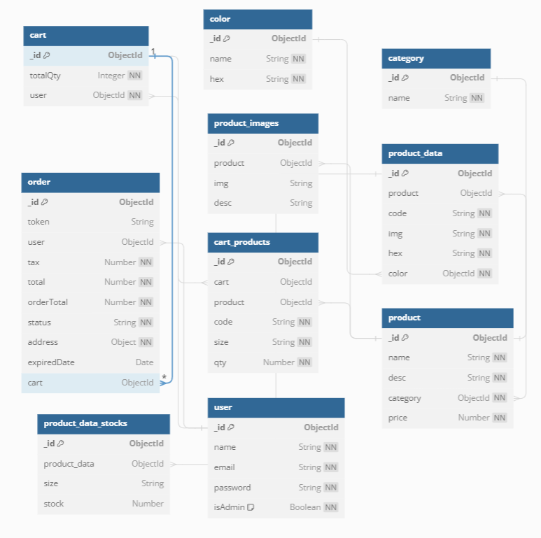

# unikmu

Unikmu is a web application inspired by Uniqlo but features a unique style distinct from its predecessor. All the data within Unikmu are seeded from Uniqlo's product database.

## app url
https://unikmu.fly.dev/

## Database Schema
[]

## Configuration
unikmu application can be configured using environment variables. You can customize database settings, data configurations, and more by modifying the .env file in the project root directory.

```bash
MONGO_URL = mongodb://localhost:27017/unikmu
PASS_SEC = 11111111
JWT_SEC = 11111111
SESSION_TIME = 3d
MIDTRANS_SERVER_KEY = 
MIDTRANS_CLIENT_KEY = 
BASE_URL = http://localhost:5000/api/
ADMIN_EMAIL = admin@gmail.com
ADMIN_PASS = admin

MIDTRANS_EXPIRED_TIME = 15 
NODE_ENV = development
FRONTEND_URL = http://localhost:5000
```

## Instalation

To install and run the unikmu application locally, follow these steps:

1.  Clone the repository
 ```bash
git clone https://github.com/nvlhnn/mern-commerce-unikmu.git
```

2. Navigate to the project directory
 ```bash
cd mern-commerce-unikmu
```

3. Seeding data
 ```bash
node seeders/product.uniqlo.seeder.js
```

4. Start the application
 ```bash
npm run start-server
```

